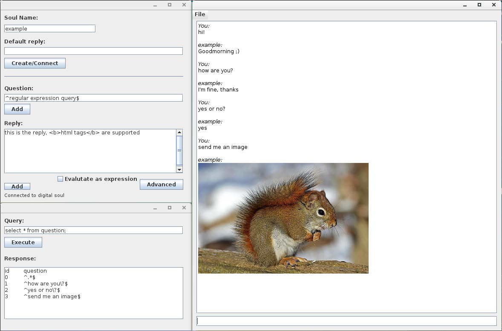

# CyberSoul

CyberSoul is a software written in Java with the aim of conserve a part of your conscience in digital format. This project is an experiment that give to you and to others the possibility to chat with a digital copy of yourself.

Basically, you can save questions with the relative answers. See below to know better what you can do.

### Version
Alpha version: 0.1

### How it works?
All the questions and the relative answers are saved in a local database.

There are the *edit mode* and the *chat mode*.
##### Edit mode
The edit mode is when you are creating or editing the database (the digital soul). In this case a question is a [regular expression] that can match one or more questions of *chat mode*. I suggest to use [this site](http://www.regexplanet.com/advanced/java/index.html) to try your regular expressions.

An answer could be a string (html tags are supported) or could be a JavaScript function executed in run-time.
In the function you can put a string into a special variable called *reply* that will be returned to the chat.
See the examples below.

###### Example 1
Return randomly answer:
```js
new java.lang.Runnable() {
run: function() {
if (Math.random() <= 0.4) reply="yes"; else reply="no";
}}
```

###### Example 2
Create and write a string into a text file:
```js
new java.lang.Runnable() {
run: function() {
f = new java.io.PrintWriter("file.txt");
f.print("string");
f.close();
} }
```

###### Example 3
Create an image on the disk and show it in the chat:
```js
new java.lang.Runnable() {
run: function() {
data = java.util.Base64.getDecoder().decode("base64 of the image");
(new java.io.FileOutputStream("image.jpg")).write(data);
reply = "</img>"
} }
```
##### Chat mode
The chat mode is when you open a soul (the database) only to ask something and get the reply. In this case a question is a simple string. When you submit a question the software searches the first regular expression that match it and then shows the relative answer. If there are many answers to a single question, the software choose randomly one answer. If the answer is a function, it will be executed and then will be printed the content of the variable *reply*.

### Screenshot


### Execution
This software was tested only on GNU/Linux. If you want run it type the following command in a terminal:
```sh
$ java -jar /path/to/cybersoul.jar
```
Under Windows try to do a double click on the jar file.

Please check if you have Java installed.

### Folders content
- src: java source code
- lib: sqlite library (you have to add this external jar when import the project)

### Todo

These are some of the features to implement:

* Implement security features
  * encrypt database
  * integrity check (with md5 hash)
  * protect the access to the chat with a password
* Improve the editor


License
----

GNU General Public License v3


[regular expression]:http://www.regular-expressions.info/

